# Tech-Articles | Simplifying CI/CD Container-Based Microservices with Azure DevOps and Azure Infrastructure.

Agenda: 
1.	Introduction
2.	Planning CI build pipeline
3.	Planning CD Deploy/Release pipeline
4.	Conclusion


## 1.	Introduction

>"DealStore" is a responsive web application with a web API in the background. The content, navigation elements, and structural layout of the website can be adapted to the screen resolution of the mobile device. The frontend was built using the Vue framework, a progressive JavaScript framework for creating web interfaces and one-page applications, to make the web application look modern and professional. An API gateway from Envoy is used as the interface between the frontend and the microservices. The backend of the  application was built using .NET 5, a framework for developing desktop, web, cloud, and mobile applications. The application uses a database that runs on the Azure Cloud and utilizes a MS SQL Server in a serverless manner.<br/>
#### Architecture
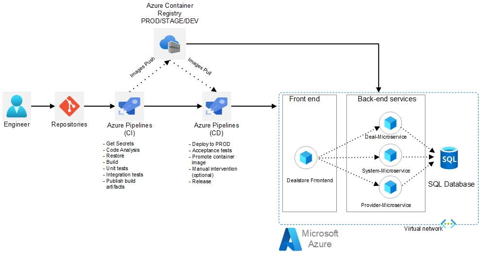
>
>#### DEAL, Provider and System microservice as backend and Frontend as a standalone service .
>
> The application uses three microservices, all of which run on Docker containers. The Deal-API manages service information such as adding/editing requests and adding/editing/searching services from companies. The Provider-API is an application programming interface that allows end-users to interact with the service. The System-API manages affected system configurations, email notifications, and log components.
>
> In this article, we'll delve into the details of how these components come together to form a successful microservice architecture, focusing on how to implement Continuous Integration and Continuous Deployment (CI/CD) for microservices on Azure App Service. By >the end of this article, you'll have a solid understanding of how to build a modern, professional, and scalable web application using microservices on Azure App Service.


## 2. Planning CI build pipeline

>Each microservice folder should contain a Dockerfile for building the container. <br />
    -To set up the CI portion of the pipeline for the DealStore application, an Azure Container Registry needs to be created where the container images will be stored. <br />
    -The build environment needs to be configured, including creating a build agent pool and specifying the tools and dependencies required to build each container image. <br />
    -Each microservice folder should contain a Dockerfile, which specifies how the container image for that service should be built. <br />
    -A build definition for each microservice needs to be created, which specifies the steps and configurations required to build the container image for that service. <br />
    -Continuous integration can be set up to automatically trigger a build when changes are pushed to the source control repository, automating the build process. <br />
    -Once the container image has been built, it can be pushed to the Azure Container Registry for storage and deployment. <br />
>By following these steps, a streamlined and automated CI pipeline for the DealStore application can be set up on Azure App Service. <br />

```yaml
yaml: 
pool:
  name: Azure Pipelines
steps:
- task: AzureResourceGroupDeployment@2
  displayName: 'Azure Deployment:Create Azure Container Registry'
  inputs:
    azureSubscription: 'DealStoreContainer - Azure'
    resourceGroupName: 'DealStoreContainer-rg'
    location: 'South Central US'
    templateLocation: 'URL of the file'
    csmFileLink: 'https://raw.githubusercontent.com/Microsoft/devops-project-samples/057f6cc268a62922d012067d069d58684e967d0a/armtemplates/webapp-containers/containerRegistry-template.json'
    overrideParameters: '-registryName "DealStoreContaineracr" -registryLocation "South Central US" -registrySku "Standard"'

- task: Docker@2
  displayName: 'Deal Microservice buildAndPush'
  inputs:
    containerRegistry: Deal
    repository: DealRepo
    Dockerfile: Backend.Deal/Dockerfile

- task: Docker@2
  displayName: 'Provider Microservice buildAndPush'
  inputs:
    containerRegistry: Deal
    repository: ProviderRepo
    Dockerfile: Backend.Provider/Dockerfile

- task: Docker@2
  displayName: 'System Microservice buildAndPush'
  inputs:
    containerRegistry: Deal
    repository: SystemRepo
    Dockerfile: Backend.System/Dockerfile

- task: Docker@2
  displayName: 'Frontend Microservice buildAndPush'
  inputs:
    containerRegistry: Deal
    repository: FrontendRepo
    Dockerfile: Frontend/Dockerfile
```


#### STEP 1
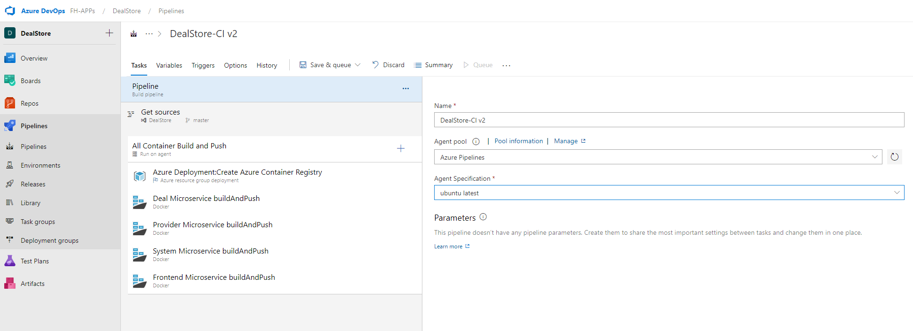

#### STEP 2
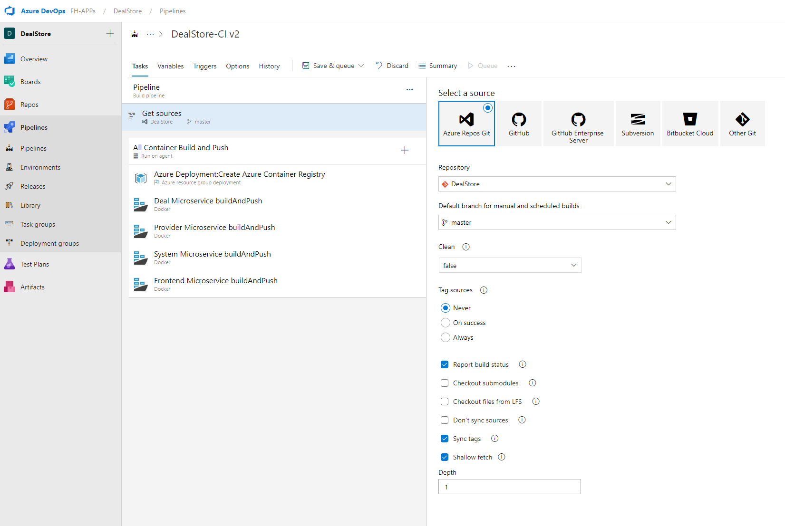

#### STEP 3
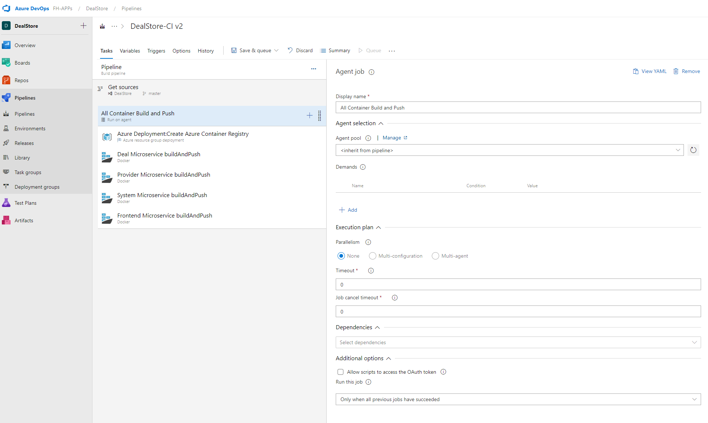

#### STEP 4
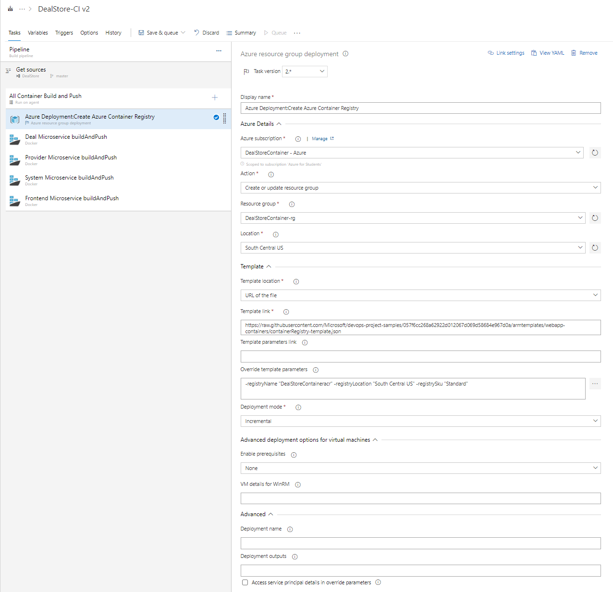

#### STEP 5
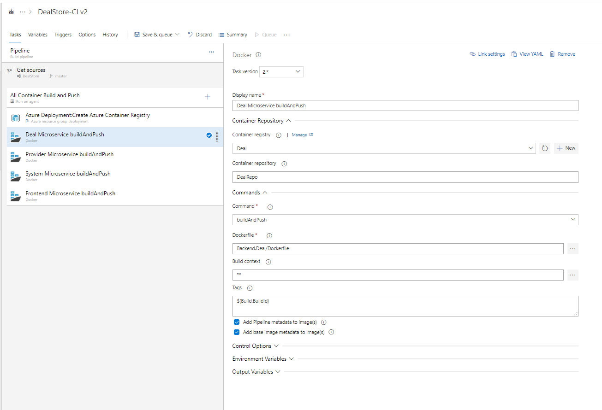

#### STEP 6
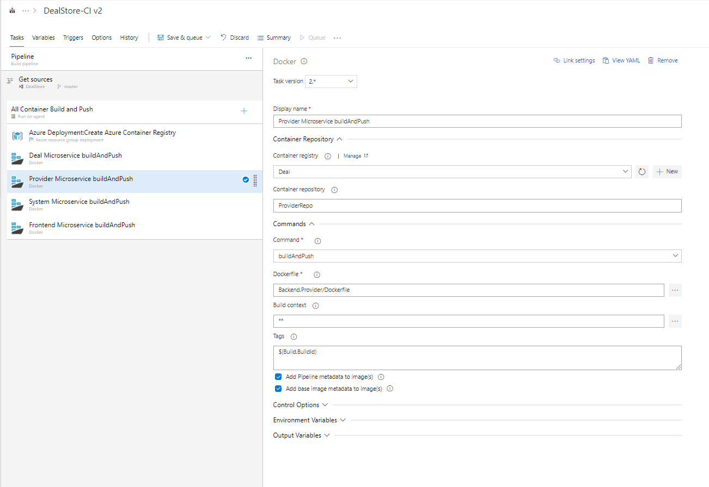

#### STEP 7
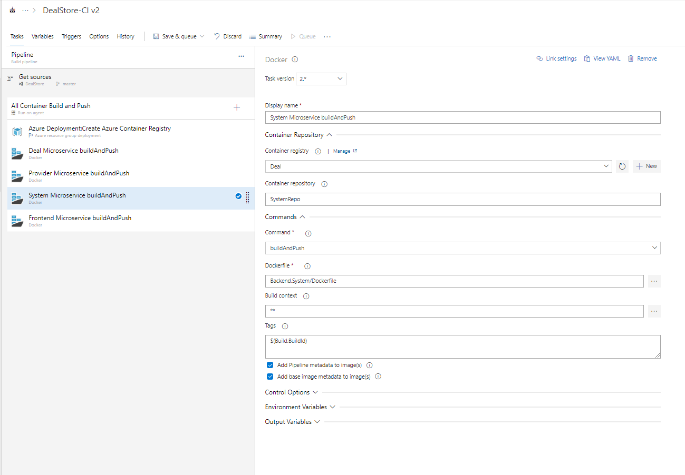

#### STEP 8
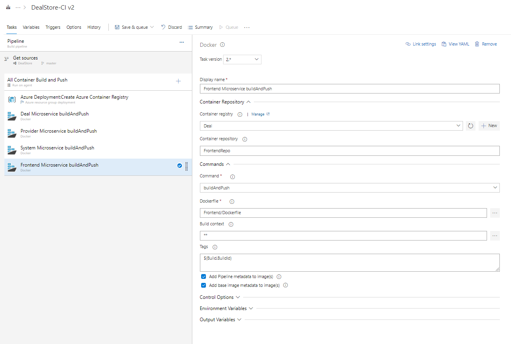


## 3.	Planning CD Deploy/Release pipeline

>•	The CD Deploy process involves creating or updating the necessary Azure App Services for each microservice and deploying the respective container images.<br/>
•	If the Azure App Service does not exist, it will be created automatically during the deployment process.<br/>
•	If the Azure App Service already exists, it will be updated with the new container image during deployment.<br/>
•	The CD Deploy process can be configured to occur automatically after a successful build or manually triggered as needed.<br/>
•	With the CD Deploy process in place, the application can be easily and reliably deployed to Azure App Service, creating a scalable and reliable environment for the application.<br/>


```yaml
steps:
- task: AzureResourceGroupDeployment@2
  displayName: 'Azure Deployment:Create Azure App Service'
  inputs:
    azureSubscription: 'DealStoreContainer - Azure'
    resourceGroupName: 'DealStoreContainer-rg'
    location: 'South Central US'
    templateLocation: 'URL of the file'
    csmFileLink: 'https://raw.githubusercontent.com/Microsoft/devops-project-samples/057f6cc268a62922d012067d069d58684e967d0a/armtemplates/webapp-containers/container-webapp-template.json'
    overrideParameters: '-webAppName FrontendUIContainer -hostingPlanName DealStoreContainer-plan -appInsightsLocation "South Central US" -sku "S1 Standard" -registryName "DealStoreContaineracr" -registryLocation "South Central US" -registrySku "Standard" 
    imageName frontendrepo:$(Build.BuildId)'
```

```yaml
steps:
- task: AzureRmWebAppDeployment@3
  displayName: 'Deploy Azure App Service'
  inputs:
    azureSubscription: 'DealStoreContainer - Azure'
    appType: applinux
    WebAppName: FrontendUIContainer
    DockerNamespace: dealstorecontaineracr.azurecr.io
    DockerRepository: frontendrepo
    DockerImageTag: '$(Build.BuildId)'
    TakeAppOfflineFlag: true
```

#### STEP 1
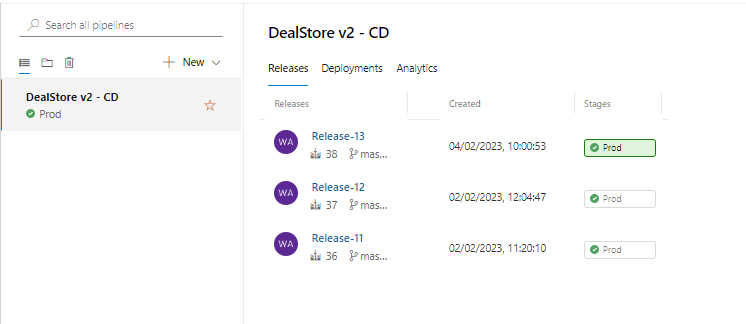

#### STEP 2
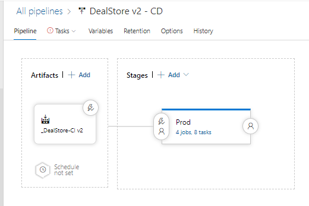

#### STEP 3
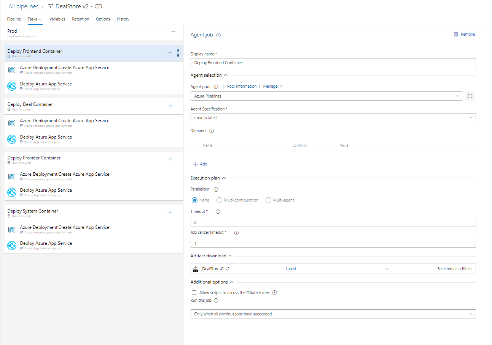

#### STEP 4
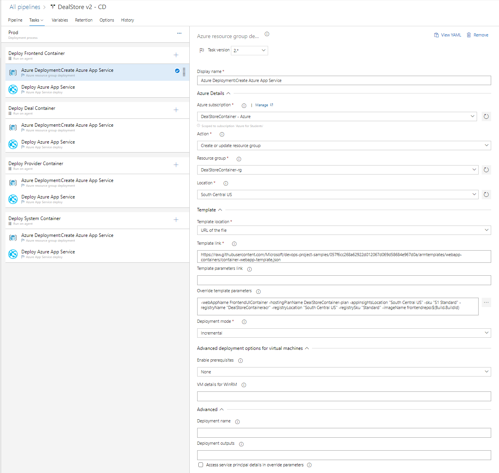

#### STEP 5
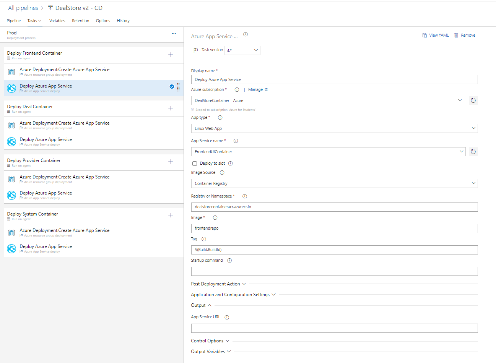


## 4.	Conclusion

>•	After successfully setting up the CI/CD pipeline for the DealStore application, the necessary infrastructure will be created and all container images will be stored in the DealStoreContaineracr Repository.<br/>
•	The microservices will be automatically deployed to their respective Azure App Services, creating a scalable and reliable environment for the application.<br/>
•	With the CI/CD pipeline in place, developers can easily and quickly make changes to the application without having to worry about manually deploying and managing the infrastructure.<br/>
•	Additionally, the use of microservices and containerization allows for greater flexibility and scalability, as each service can be independently scaled and deployed as needed.<br/>
•	Overall, the implementation of CI/CD for microservices on Azure App Service helps to streamline the development process and improve the reliability and scalability of the DealStore application.<br/>

#### Resources
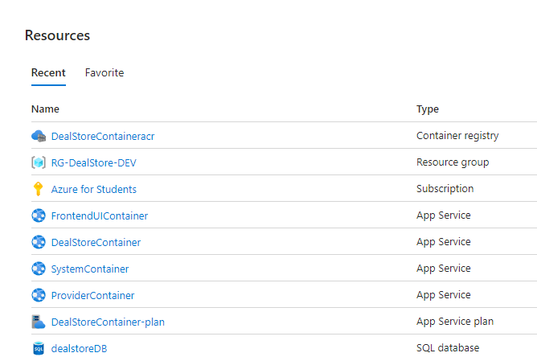

### CREDITS
> Cloud Architect<br/>
> BSc, Wael Amer <br/>
> wael.amer@gmail.com<br/>